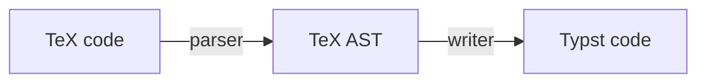

# tex2typst
JavaScript library for converting TeX math formula code to Typst

## Installation

```bash
npm install tex2typst
```

## Usage

```javascript
import { parseTex, tex2typst } from 'tex2typst';

const output = tex2typst("\\zeta(s) = \sum_{n=1}^{\\infty}\\frac{1}{n^s}");
console.log(output);
// zeta(s) = sum_(n = 1)^infinity frac(1, n^s)
```

## How it works



- parser: Implemented in function `parseTex()`. At present, it depends on the parser implemented by [KaTeX](https://github.com/KaTeX/KaTeX).
- writer: Implemented in class `TypstWriter()`

## Contributing

Feel free to open an issue or submit a pull request.
