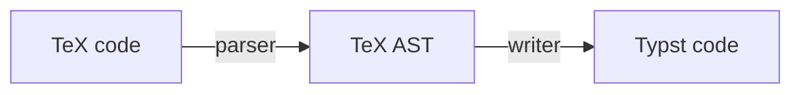

# tex2typst
JavaScript library for converting TeX / LaTeX math formula code to Typst

## Try it online

A Web UI wrapper is available at [https://qwinsi.github.io/tex2typst-webapp/](https://qwinsi.github.io/tex2typst-webapp/).

## Installation

```bash
npm install tex2typst
```

## Usage

### Basic usage

```javascript
import { parseTex, tex2typst } from 'tex2typst';

let output = tex2typst("\\zeta(s) = \\sum_{n=1}^{\\infty}\\frac{1}{n^s}");
console.log(output);
// zeta(s) = sum_(n = 1)^infinity frac(1, n^s)
```

### Advanced settings

- custom TeX macros/commands

For example,
```javascript
let macros = {
    "\\sgn": "\\operatorname{sgn}"
};
let input = "y = \\sgn(x)";
const output = tex2typst(input, {customTexMacros: macros});
console.log(output);
// y = op("sgn")(x)
```

## How it works



- parser: Implemented in function `parseTex()`. At present, it depends on the parser implemented by [KaTeX](https://github.com/KaTeX/KaTeX).
- writer: Implemented in class `TypstWriter()`

## Contributing

Feel free to open an issue or submit a pull request.
