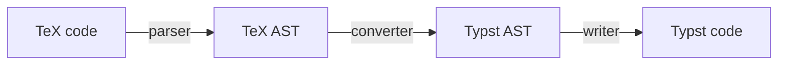

# tex2typst
JavaScript library for converting TeX / LaTeX math formula code to Typst

## Try it online

A Web UI wrapper is available at [https://qwinsi.github.io/tex2typst-webapp/](https://qwinsi.github.io/tex2typst-webapp/).

## Installation

## Installing it in a Node.js project

```bash
npm install tex2typst
```

## Or just loading it in a web page

```html
<script src="https://cdn.jsdelivr.net/npm/tex2typst@0.2.7/dist/tex2typst.min.js"></script>
<!-- or  -->
<script src="https://unpkg.com/tex2typst@0.2.7/dist/tex2typst.min.js"></script>
```

Replace `0.2.7` with the latest version number in case this README is outdated.

The size of minimized library `tex2typst.min.js` is about 23 KB.

## Usage

### Basic usage

```javascript
import { tex2typst } from 'tex2typst';

let output = tex2typst("\\zeta(s) = \\sum_{n=1}^{\\infty}\\frac{1}{n^s}");
console.log(output);
// zeta(s) = sum_(n = 1)^infinity frac(1, n^s)
```

If you are using the library in a web page via a `<script>` tag, you don't need the line of `import`, function `tex2typst` should be available in the global scope.


### Advanced options

- custom TeX macros/commands

For example,
```javascript
let macros = {
    "\\sgn": "\\operatorname{sgn}"
};
let input = "y = \\sgn(x)";
let output = tex2typst(input, {customTexMacros: macros});
console.log(output);
// y = op("sgn")(x)
```

## How it works



- parser: Implemented in class `LatexParser`.
- converter: Implemented in function `convertTree`.
- writer: Implemented in class `TypstWriter`.

## Contributing

Feel free to open an issue or submit a pull request.
