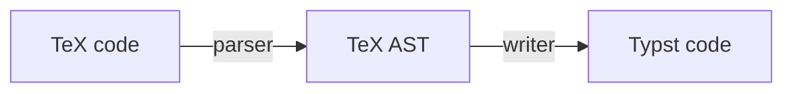

# tex2typst
JavaScript library for converting TeX math formula code to Typst

## How it works

- parser: Implemented in function `parseTex()`. At present, it depends on the parser implemented by [KaTeX](https://github.com/KaTeX/KaTeX).
- writer: Implemented in class `TypstWriter()`
